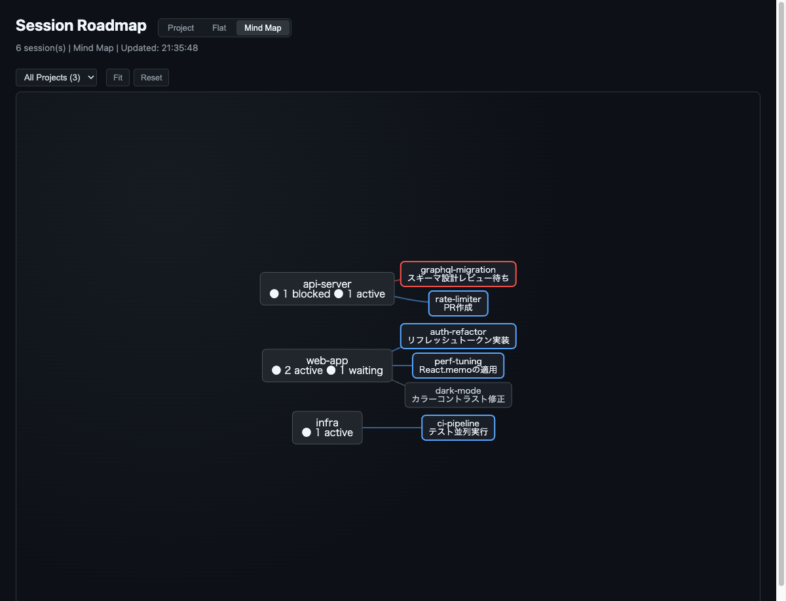
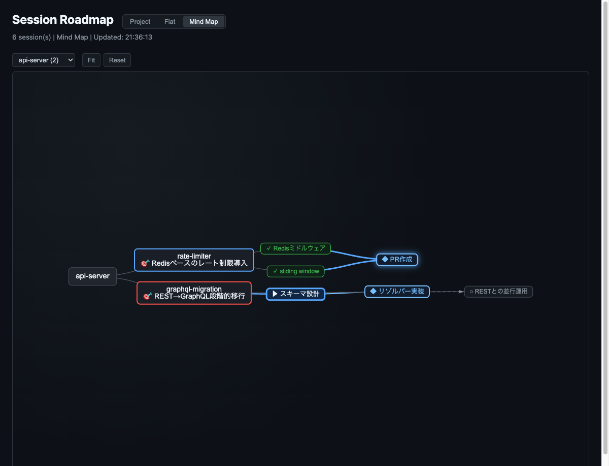
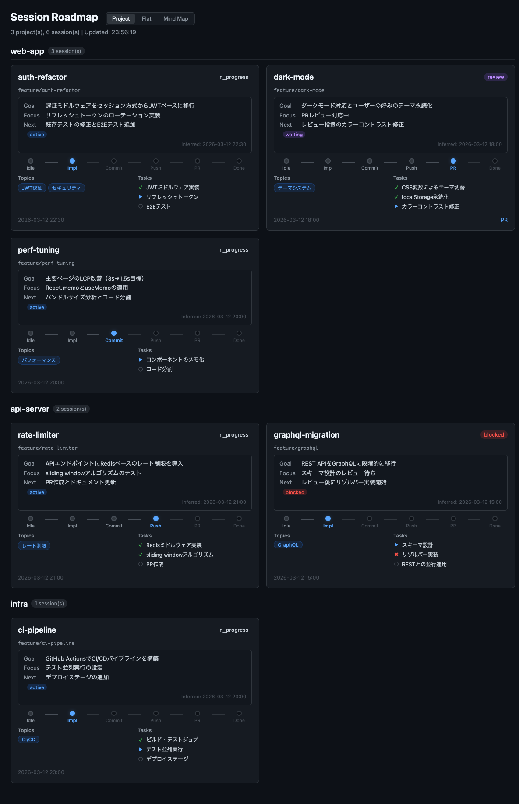

# devctx

[](https://go.dev/)
[](https://opensource.org/licenses/MIT)
[](https://github.com/hiroyannnn/devctx/releases)

[日本語](README.ja.md)

A CLI tool for managing Claude Code sessions and git worktrees with **Mind Map visualization**.

See all your sessions at a glance — what's active, what's blocked, and where each task is heading.



Drill into a project to see the **semantic task flow** — branching, merging, and rejected tasks visualized as a DAG.




## Features

- **Mind Map View** - Semantic DAG visualization of task flows (branching, merging, rejection)
- **Kanban View** - Visualize session states at a glance
- **AI Insights** - Claude infers goal, focus, next step, and attention state for each session
- **Auto Session Tracking** - Automatic registration via Claude Code hooks
- **Status Management** - in-progress / review / blocked / done
- **Shell Integration** - One-command context switching
- **fzf Integration** - Interactive context selection
- **TUI Dashboard** - Interactive UI powered by Bubble Tea
- **Time Tracking** - Accumulated work time per session
- **GitHub Integration** - Auto-detect and link Issues/PRs
- **Worktree Creation** - Create branch to Claude launch in one command
- **Session Roadmap** - Auto-detect development phases

## Installation

```bash
go install github.com/hiroyannnn/devctx@latest
```

Or build from source:

```bash
git clone https://github.com/hiroyannnn/devctx.git
cd devctx
go build -o devctx .
mv devctx ~/.local/bin/  # or /usr/local/bin/
```

## Quick Start

```bash
# Set up Claude Code hooks (auto session tracking)
devctx hooks --install

# Open the Mind Map dashboard
devctx roadmap serve
```

That's it. Start using Claude Code as usual — sessions are tracked automatically via hooks.

### Codex Hooks and Agent State

```bash
# Install Codex hooks into $CODEX_HOME/hooks.json (default ~/.codex/hooks.json)
devctx hooks --install --provider codex
```

Codex does not run new or changed hooks until you trust them: run `/hooks` in Codex to review and trust the devctx entries (re-trust is required whenever a devctx entry changes, e.g. after upgrading devctx). Existing keys and other tools' hooks in `hooks.json` are preserved, and re-running the install is idempotent.

Hooks record the agent state shown on the Mind Map and cards:

| State | Set by |
|-------|--------|
| running | `UserPromptSubmit`; Codex also `PostToolUse` (returns to running once a permission is approved) |
| needs input | `Notification` (permission / elicitation / idle, Claude Code), `PermissionRequest` and `request_user_input` `PreToolUse` (Codex) |
| turn done | `Stop`; Codex also `Interrupt` |
| ended | `SessionEnd` |

Codex state hooks run with `"async": true` so they never block the agent; `SessionEnd` is synchronous in Codex (1s by default), so devctx installs it with `timeout: 3` and skips the git-based phase scan there.

Known limitations (Codex):
- `PermissionRequest` fires right before Codex asks; if another hook or an auto-approval allows the request, Codex never actually waits.
- With parallel tool calls, a `PostToolUse` from another tool can return the state to running while a permission is still pending.
- `Stop` can be continued by other Stop hooks, so turn done is a best-effort signal.

### Claude State from Agent View

For Claude, the dashboard (Mind Map / cards), `devctx list`, `devctx tui` and `devctx status` overlay the live state from `claude agents --json` (Claude Code agent view) on the hook state, and show why a session is waiting, e.g. `claude · needs input · permission prompt`.

- Matching: by session ID first; otherwise by the git toplevel of the live session's cwd equal to the context's worktree, only when exactly one live session matches. Ambiguous matches keep the hook state.
- Hooks stay as the fallback (agent view unavailable, timeout, no match) and as the source for registration and `ended`. A hook that arrives after a fetch started, or `ended`, always wins over the live state.
- Absence from agent view is **not** treated as ended: restricted environments can return an empty list even while sessions exist.
- The `dx` fzf picker and shell completion (`list --fzf` / `--names-only`) use hook state only, for speed. (`dxl` / `dxw` are plain `list` / `list --watch`, so they do show live state.) Hooks themselves never call `claude agents`.
- Live values are display-only and are never written to `contexts.yaml`.

### What the Agent Is Waiting For

When a session needs input, devctx also records **what** it is waiting for from the hook payload and shows it in place of the generic reason, e.g. `claude · needs input · Bash: Run tests`.

| Kind | Source hook |
|------|-------------|
| bash / edit / mcp / plan / network / other | `PermissionRequest` (Claude Code and Codex) |
| question | `PreToolUse` for `AskUserQuestion` (Claude Code) / `request_user_input` (Codex) |
| cleared | `UserPromptSubmit`, `Stop`, `SessionEnd`, Codex `Interrupt`, and a Codex `PostToolUse` whose `tool_input` matches the pending request |

Privacy: command bodies, file contents and other free text are never stored. Only a short summary is kept: the Bash `description` or the program name (first token, basename), the file base name, the MCP `server/tool`, the URL host, or the question `header`. A hash of `tool_input` is stored solely to match the later `PostToolUse`.

Known limitations:
- Manually denying a request fires no hook, so the request stays until the next prompt, `Stop` or interrupt.
- Claude sandbox network requests (`sandbox request`) and other dialogs are not classified; for Claude the pending label is shown only when it is consistent with the live waiting reason (`permission prompt` for tool requests, `input needed` for questions).
- There is a single slot: with parallel requests the latest one is shown.
- Hooks are async, so the label can lag the state by a moment.

To get the new hooks, re-run `devctx hooks --install` (Claude Code) and `devctx hooks --install --provider codex`, then review and trust the changed entries with `/hooks` in Codex.

### Islands

An **island** is a theme node you make by hand (e.g. `人事強化`), shown in the **All Projects** Mind Map. It does not need a repo. Islands and repos form **one tree**: a repo can sit under an island, and an island can sit under a repo. Agent sessions attach to their repo automatically; repos you do not attach stay at the top level.

```bash
devctx island add 人事強化 --id hr            # --id is needed to refer to a non-ASCII name (otherwise island-N)
devctx island attach devctx --to hr            # repo "devctx" under island "hr"
devctx island add 採用フロー --id hiring --parent island:hr
devctx island attach island:m3 --to repo:.     # island "m3" under the repo of the current directory
devctx island detach devctx                    # back to the top level
devctx island rm hr --reparent                 # children move up to hr's parent
devctx island list                             # tree, with active sessions per repo
```

When the id is derived from the name and is already taken, devctx appends `-2`, `-3`, ... (`API` → `api`, `api-2`); an explicit `--id` that is taken is an error. Renaming never changes an id.

Refs are `island:<id>` or `repo:<path>` (`repo:.` is the repo of the current directory). A bare name matches an island id, then a repo basename. If it matches both an island and a repo, or several repos share the basename, devctx lists the candidates as typed refs and changes nothing. `island rm` refuses while the island has children unless you pass `--reparent`. Cycles (including island → repo → island) are rejected.

The tree is stored in `~/.config/devctx/islands.yaml` as typed refs (repo paths are symlink-resolved, the same key used to group sessions by repo):

```yaml
islands:
  - id: hr
    name: 人事強化
  - id: m3
    name: M3 UI
    parent: repo:/Users/me/code/devctx
repos:
  - root: /Users/me/code/devctx
    parent: island:hr
```

A parent that no longer exists is shown at the top level, and `island list` warns about it.

#### Editing in the dashboard

In **All Projects**, the Mind Map edits the same tree as the CLI (changes go through the same lock, so they do not clobber each other).

- **Right-click** a node: the root offers "島を追加"; an island offers "子の島を追加" / "名前を変更" / "親から外す" (only if it has a parent) / "削除"; a repo offers "子の島を追加" / "親から外す". A session offers "タスクに付ける…" / "タスクから外す" (see [Tasks](#tasks)).
- **Keyboard** (click the map to focus it, select a root / island / repo node): `Tab` adds a child island, `Enter` adds a sibling (under the root for top-level nodes), `F2` or `Space` renames, `Delete` / `Backspace` deletes (islands only). `Enter` / `Esc` confirm / cancel the name input.
- **Drag to re-parent**: drag an island or repo node onto another island or repo to attach it there, or onto the root (`devctx`) node to detach it to the top level. The drop target gets a dashed red border while you hover it; `Esc` cancels, and dragging outside the map clears the highlight so releasing there does nothing. A node that was not re-parented (cancel, no-op drop, or a rejected change) returns to where it started. Nodes you cannot drop on (the dragged node and its descendants) are never highlighted. Dropping on the current parent does nothing. Sessions and "+N more" nodes cannot be re-parented (they can still be moved visually).
- **repo を付ける…** (island menu): attach any repo devctx knows about (`GET /api/islands/known-repos`: sessions and `islands.yaml`), minus repos already under that island and repos that would create a cycle. This is how you re-attach a repo that disappeared from the map after "親から外す" because it has no active sessions.
- Deleting an island that has children asks for confirmation and moves the children up to its parent. If the children changed since you looked (CLI or another tab), nothing is deleted and the map refreshes.
- While a menu, input or confirmation is open the map does not redraw; the latest data is applied when you close it. Zoom and pan are kept across redraws.
- Only repos devctx already knows (from sessions or `islands.yaml`) can be attached.
- vis-network's own keyboard pan/zoom is off (it listens on the whole window and would fight the name input); use the mouse to pan and zoom.

#### Tasks

A **task** is a hand-made node for one piece of work, placed under an island or a repo (it is an island of kind `task` in `islands.yaml`). A task always has a parent, and **nothing can be placed under a task** (no island, repo or task); adding or attaching one is rejected. Ids are `t1`, `t2`, ... from a counter (`task_seq`) that is never reused, even after a task is deleted.

```bash
devctx task add 求人票を直す --to hiring       # --to takes the same refs as island attach; prints island:t1
devctx task done t1                            # --undo to reopen
devctx island rename t1 "求人票を直す (v2)"     # rename / rm / attach work on tasks too
devctx island list                             # └── 求人票を直す [task t1] ✓
```

In the Mind Map, tasks are white boxes with a blue border, prefixed `☐` (open) or `✓` (done, dimmed).

- **Right-click** a task: "プロンプトとしてコピー" / "完了にする" (or "未完了に戻す") / "名前を変更" / "削除". There is no "親から外す" because a task needs a parent. An island or repo offers "タスクを追加". Keyboard on a task: `Enter` adds a sibling task, `F2` / `Space` renames, `Delete` deletes; `Tab` does nothing.
- **Drag** a task onto an island or repo to move it. Tasks are never drop targets, and the root is not highlighted as a target while dragging a task (it needs a parent).
- `island rm --reparent` on a top-level island that has task children is refused ("tasks need a parent; move them first"); move the tasks with `island attach` first. `island list` warns about a task with no parent (hand-edited yaml).
- **プロンプトとしてコピー** puts the task name and a marker line on the clipboard:

  ```
  求人票を直す

  [devctx:task:t1]
  ```

  The marker `[devctx:task:<id>]` is always the last line. If the browser refuses clipboard access, a small panel with the text preselected is shown instead.
- API: `POST /api/islands/ops` accepts `{"op":"add","kind":"task","name":...,"parent":...}` (parent required) and `{"op":"done","ref":"island:t1","done":true}`.

##### Linking sessions to a task

A session hangs under a task in the All Projects Mind Map (the task → session edge replaces repo → session). In the single-project view and the inspector the task name is shown as "▸ <task name>". If the task was deleted, the session stays under its repo and shows "▸ 削除済み tN".

- **By marker (automatic)**: paste the copied prompt as the first prompt of a session. On `UserPromptSubmit`, the hook looks at the **last line** of the prompt (blank lines and Claude Code's `<pasted_content ...>` tag lines are skipped); if that line is exactly `[devctx:task:<id>]` and the task exists, the session is linked. A marker in the middle of the text, or not on the last line, is ignored. The prompt text itself is parsed in memory and never stored.
- **Keep the marker as the last line.** Text typed after the pasted marker moves it off the last line and disables auto-linking; in that case use "タスクに付ける…" in the Mind Map or `devctx task link` instead.
- **`/clear` is covered by the `SessionStart` hook** (matcher `clear`, so `register` runs for the new session id and the link survives). Hooks installed before this change lack it: re-run `devctx hooks --install` (Claude Code) to pick it up. `compact` is not hooked because it keeps the same session.
- **By hand**: `devctx task link <context> <task>` / `devctx task unlink <context>`, or right-click a session in the Mind Map ("タスクに付ける…" lists existing tasks with their parent path, open tasks first and done tasks marked `✓`; "タスクから外す" appears when it is linked). `island list` shows how many sessions are linked under each task (`[task t3] (2 sessions)`).
- **Only the first marker of a session counts.** A later marker in the same session is ignored. Claude Code reuses one context per worktree, so a link **stays when the same worktree starts a new session**, and the first marker of that new session replaces it. Codex has one context per session.
- **Linking never changes the task.** It does not mark the task done, and PR created / merged milestones do not touch `islands.yaml` either; completion is always `task done` or the menu.
- **Known limitation**: the TUI, the kanban (`devctx list` interactive) and `roadmap refresh` save the whole store without taking the lock, so they can drop a link made in the meantime. Tracked separately.
- API: `POST /api/sessions/ops` accepts `{"op":"link","name":"<context>","task":"island:t1"}` and `{"op":"unlink","name":"<context>"}`. `/api/roadmap`, `/api/roadmap-map` and `/api/roadmap-graph` carry `task_ref` and `task_label` per session.

#### Security note

The dashboard listens on `127.0.0.1` only, and now also checks every request: the `Host` header must be `127.0.0.1:<port>` or `localhost:<port>` (guards against DNS rebinding, GET included), and changes (`POST /api/islands/ops`, `POST /api/sessions/ops`) additionally need `Content-Type: application/json` and an `Origin` equal to `http://<Host>`. Open the dashboard at `http://127.0.0.1:<port>` or `http://localhost:<port>`; other host names (a LAN IP, a tunnel, a reverse proxy) get `403`.

### Optional Setup

```bash
# Install slash commands for Claude Code (/devctx-review, /devctx-done, etc.)
devctx commands --install

# Enable shell shortcuts (add to .bashrc / .zshrc)
eval "$(devctx shell-init)"
```

## Kanban View Example

```
🚀 In Progress
╭──────────────────────────────────────────────╮
│ [auth]                                       │
│   💬 zesty-hopping-falcon                    │
│   ⎇ feature/auth                             │
│   ⏱ 2h ago  ⌛ 4h32m                         │
│   📝 Working on OAuth2 refresh tokens        │
╰──────────────────────────────────────────────╯

👀 Review
╭──────────────────────────────────────────────╮
│ [api-fix]                                    │
│   💬 playful-coding-knuth                    │
│   ⎇ fix/api-error                            │
│   ⏱ 30m ago                                  │
│   🔀 https://github.com/user/repo/pull/123   │
│   ☑ /compact                                 │
│   ☐ /create-pr                               │
╰──────────────────────────────────────────────╯
```

💬 shows Claude Code's auto-generated session name (slug).

## Commands

### Basic Operations

| Command | Description |
|---------|-------------|
| `devctx list` | Display contexts in kanban view |
| `devctx tui` | Open interactive TUI dashboard |
| `devctx show <name>` | Show context details |
| `devctx register <name>` | Register a context (usually auto via hook). Use `--provider codex` to register a non-Claude agent as a separate context in the same worktree |
| `devctx resume <name>` | Resume a context |
| `devctx move <name> <status>` | Change status |
| `devctx touch <name>` | Update context's last-seen timestamp |
| `devctx archive <name>` | Archive as done |
| `devctx remove <name>` | Remove a context from tracking |

### Creation & Configuration

| Command | Description |
|---------|-------------|
| `devctx new <branch>` | Create worktree + cd + claude in one go |
| `devctx note <name> [msg]` | Add/show a note |
| `devctx link <name> <url>` | Link GitHub Issue/PR |
| `devctx hooks [--install] [--provider codex]` | Set up Claude Code hooks (or Codex hooks with `--provider codex`; trust them via `/hooks` in Codex) |
| `devctx commands [--install]` | Set up Claude slash commands |

### GitHub Integration

| Command | Description |
|---------|-------------|
| `devctx sync [name]` | Auto-detect and link PR/Issue |
| `devctx sync --all` | Update session names for all contexts |
| `devctx pr <name>` | Create a PR |

### Session Roadmap

| Command | Description |
|---------|-------------|
| `devctx roadmap scan` | Show git-based phases for all sessions |
| `devctx roadmap status` | Visual progress through development phases |
| `devctx roadmap serve` | Start web dashboard (localhost:3333) |
| `devctx roadmap refresh` | Full re-scan with PR detection (uses gh CLI) |
| `devctx roadmap analyze [name]` | Generate AI insights via Claude CLI |
| `devctx roadmap analyze --all` | Generate insights for all active sessions |
| `devctx roadmap init --prompt "..."` | Set initial prompt for a session |
| `devctx insight [name]` | Show/set session insights manually |

### Monitoring & Search

| Command | Description |
|---------|-------------|
| `devctx discover` | Find existing Claude Code and Codex sessions (Codex: interactive sessions from the last 14 days) |
| `devctx discover --provider codex` | Restrict discovery to one provider (`claude` / `codex`) |
| `devctx discover --import` | Import discovered sessions |
| `devctx status` | Show live status of all contexts |
| `devctx status --watch` | Continuously monitor status |
| `devctx search <query>` | Search through session history |

### Maintenance

| Command | Description |
|---------|-------------|
| `devctx stats` | Show statistics |
| `devctx clean` | Remove old contexts (default: done > 30 days) |
| `devctx clean --days=7` | Remove contexts older than 7 days |
| `devctx clean --done=false` | Remove old contexts regardless of status |
| `devctx clean --dry-run` | Preview what would be removed |

## Shell Integration

Add to `.bashrc` or `.zshrc`:

```bash
eval "$(devctx shell-init)"
```

Shortcuts:
- `dx` - Select context via fzf and resume (shows list if fzf not available)
- `dx <name>` - Resume context (cd + claude --resume)
- `dx -` - Resume last touched context
- `dxl` - List contexts
- `dxw` - Watch mode (interactive kanban)
- `dxm <name> <status>` - Change status
- `dxn <branch>` - Create new worktree
- `dxs` - Sync GitHub info
- `dxt` - Open TUI dashboard
- `dxp` - Show live status
- `dxf <query>` - Search session history
- `dxd` - Discover existing sessions

## Watch Mode

Interactive kanban view with keyboard controls:

```bash
devctx list -w   # or dxw
```


**Navigation:**
- `↑`/`↓` or `j`/`k` - Move cursor
- `g`/`G` - Jump to top/bottom

**Actions:**
- `Enter` or `c` - Copy resume command to clipboard
- `o` - Open in new terminal

**Status Changes:**
- `r` - Move to Review
- `p` - Move to In Progress
- `b` - Move to Blocked
- `D` - Move to Done
- `x` - Delete context
- `q` - Quit

## Configuration

Config file: `~/.config/devctx/config.yaml`

```yaml
# Show completed items for N days (default: 1)
done_retention_days: 1

# Disable auto-import of sessions (default: true)
# When enabled, `devctx list` also imports recent (last 2 days) interactive Codex sessions on every run
auto_import: false

statuses:
  - name: in-progress
    next: [review, blocked, done]
  - name: review
    next: [in-progress, done]
    checklist:
      - /compact
  - name: blocked
    next: [in-progress]
  - name: done
    next: []
    archive: true
    checklist:
      - /create-pr
```

### Customizing Checklists

Add items to confirm during status transitions:

```yaml
statuses:
  - name: review
    next: [in-progress, done]
    checklist:
      - /compact
      - /code-simplifier
      - "PR draft created?"
```

## Claude Code Custom Commands

Install slash commands for Claude Code:

```bash
devctx commands --install
```

This creates:
- `/devctx-review` - Move to review status
- `/devctx-done` - Mark as done
- `/devctx-blocked` - Mark as blocked
- `/devctx-note` - Add a note
- `/devctx-link` - Link Issue/PR
- `/devctx-status` - Show context status
- `/devctx-insight` - Save session insights (goal, focus, next step, state)

A rule file (`~/.claude/rules/devctx-insight-auto.md`) is also installed, which instructs Claude to automatically run `/devctx-insight` after creating implementation plans.

## Session Roadmap

The roadmap tracks your development lifecycle automatically.

### Phase Detection

Phases are auto-detected from git state on `register` / `touch`:

| Phase | Condition |
|-------|-----------|
| Idle | No changes, no commits ahead |
| Implementation | Uncommitted changes |
| Committed | Commits ahead of base branch |
| Pushed | Remote branch up to date |
| PR Open | Open pull request detected |
| Done | Merged pull request |

### Milestone Tracking

Development milestones are automatically recorded as events:

| Milestone | Source |
|-----------|--------|
| First Commit / Commits | git log on `register` / `touch` |
| First Push | git remote check |
| PR Created / Merged | `gh` CLI on `roadmap refresh` |
| Session Start / End | Claude Code hooks |
| Status Changes | `devctx move` commands |

Events are stored in `~/.config/devctx/events.yaml` as an append-only log.

### AI Insights

Claude can infer session context and save it as insights:

```bash
# Install custom commands + auto-execution rule
devctx commands --install

# In Claude Code, after a plan is created:
# Claude automatically runs /devctx-insight

# Or manually trigger analysis via Claude CLI:
devctx roadmap analyze
```

Insights include:
- **Goal** - What this session is trying to achieve
- **Current Focus** - What's being worked on now
- **Next Step** - What should be done next
- **Attention State** - active / waiting / idle / blocked
- **Topics** - Semantic themes extracted from git and LLM (e.g., "auth", "error handling")
- **Tasks** - Concrete work items with status (planned / in_progress / done / blocked)

Topic/task extraction uses a hybrid approach: mechanical extraction from git (branch names, commit messages, changed directories) combined with LLM-based clustering and normalization.

### Web Dashboard

```bash
devctx roadmap serve
```

Opens a web dashboard at `http://localhost:3333` with:
- **Project grouping** - Sessions grouped by repository
- **Phase pipeline** - Visual progress through development phases
- **Milestone chips** - Sessions/Commits/Pushed/PR status at a glance
- **Topics & Tasks** - Semantic topics and task lists per session
- **Event timeline** - Click a card to expand its full event history
- **Project / Flat / Mind Map view** - Switch between grouped, flat, and mind map layouts
- **Mind Map view** - Semantic DAG visualization with task branching, merging, and rejection. Drag nodes to rearrange.



## Troubleshooting

### Hooks not working

1. Check settings with `devctx hooks`
2. Run `/hooks` in Claude Code to approve
3. Ensure `devctx` is in PATH

### Session not auto-registered

- Verify `SessionStart` hook is properly configured
- Test manually with `devctx register`

### resume doesn't change directory

Due to shell constraints, subprocesses cannot change the parent shell's directory.
Use shell integration (`eval "$(devctx shell-init)"`) or manually execute the displayed commands.

## License

MIT
